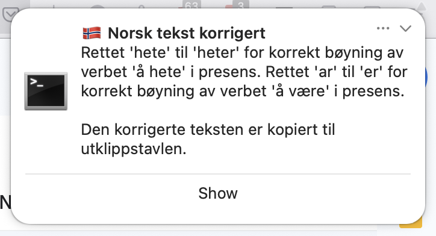

# 🇳🇴 Norskish

**Norskish** is a lightweight macOS app that helps you correct Norwegian grammar quickly from anywhere. Using a global hotkey (`Ctrl+Shift+C`) it will take whatever Norwegian text is in your clipboard and pass the corrected Norwegian text back to your clipboard. Built using Python, OpenAI's GPT-4o model, and macOS-native notifications.

### Features
- Clipboard-based correction with explanation
- macOS notifications
- Menu-less background app
- Keychain-secured OpenAI API key
- No Python installation required for users

### Setup
1. Clone the repo
2. Install dependencies: `pip install -r requirements.txt`
3. Add your OpenAI API key:  
   `python -c "import keyring; keyring.set_password('openai', 'api_key', 'your-key')"`
4. Build the app: `python setup.py py2app`
5. Find it in `dist/Norskish.app`

### Permissions
Terrifyingly, Norskish needs the following permissions to run:
- Go to **System Settings > Privacy & Security > Input Monitoring** and enable Norskish. This is required to detect when the hotkey is pressed.
- Go to **System Settings > Accessibility** and enable Norskish. This is required for the app to access the clipboard and detect keyboard shortcuts.
- If you would like a notification with the explanation of corrections made, Norskish also needs permission to display notifications. Go to **System Settings >  Notifications > Script Editor** and toggle Norskish to allow.
- To allow Norskish access to `openai.api_key` in the macOS Keychain, add the app to the item's access control list in Keychain Access, enable Accessibility in System Settings, and ensure it's properly codesigned if needed.
- If for whatever reason you are having difficulty setting the correct permissions for Norskish, you can reset them by running the following command in Terminal:
`tccutil reset Accessibility com.tylerstewart.norskish`
`tccutil reset All com.tylerstewart.norskish`

### Launching on Startup
To have Norskish start automatically when you log in:
1. Open **System Settings**
2. Go to **General > Login Items**
3. Under **"Open at Login"**, click the **`+` button**
4. Select your installed `Norskish.app` from `/Applications` or `~/Applications`
✅ That’s it — the app will now launch silently in the background on startup.

### Credits
Built by Tyler Stewart. Inspired by the need to write better norsk på jobb 💼🇳🇴

### License
MIT — Free to use, fork, remix, and improve.